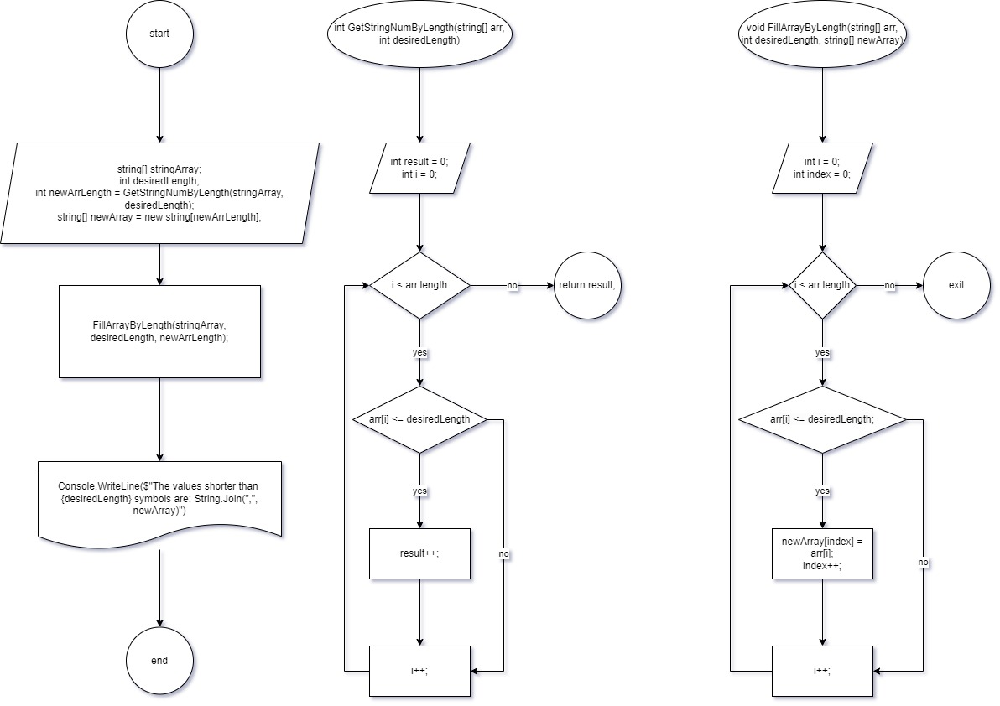

# Итоговая контрольная работа по основному блоку

## Содержание
[Описание решения](#описание-решения)

[Блок-схема](#блок-схема)

[Задание](#задание)

[Задача](#задача)

[Примеры](#примеры)

## Описание решения
Я разбила решение на 2 этапа, каждый из которых представлен отдельным методом: посчитать количество элементов, меньше или равных по длине заданному числу, и записать их в новый массив.
В общем и целом, использован следующий алгоритм:  
1. Задать массив
2. Задать число, меньше или равным которому должна быть длина элементов
3. Посчитать количество элементов в массиве из п.1, меньше или равных по длине заданному числу
4. Задать новый массив с количеством элементов, рассчитанных в п.2.
5. Записать в массив из п.3 элементы из сассива из п.1, меньше или раавные по длине заданному числу.

## Блок-схема

[Flowchart on Google Drive](https://drive.google.com/file/d/13k28JkD2a0xOYXQvxLhCqkOA_TSXN5a2/view?usp=drive_link)

[Link to the .drawio file](https://drive.google.com/file/d/1l3hvQlYq3LwYbp9d9WIzsm7Yea5G9Q1O/view?usp=sharing)

## Задание
1. Создать репозиторий на GitHub
2. Нарисовать блок-схему алгоритма (можно обойтись блок-схемой основной содержательной части, если вы выделяете её в отдельный метод)
3. Снабдить репозиторий оформленным текстовым описанием решения (файл README.md)
4. Написать программу, решающую поставленную задачу
5. Использовать контроль версий в работе над этим небольшим проектом (не должно быть так, что всё залито одним коммитом, как минимум этапы 2, 3, и 4 должны быть расположены в разных коммитах)

## Задача

Написать программу, которая из имеющегося массива строк формирует новый массив из строк, длина которых меньше, либо равна 3 символам. Первоначальный массив можно ввести с клавиатуры, либо задать на старте выполнения алгоритма. При решении не рекомендуется пользоваться коллекциями, лучше обойтись исключительно массивами.

## Примеры

[“Hello”, “2”, “world”, “:-)”] → [“2”, “:-)”]

[“1234”, “1567”, “-2”, “computer science”] → [“-2”]

[“Russia”, “Denmark”, “Kazan”] → []